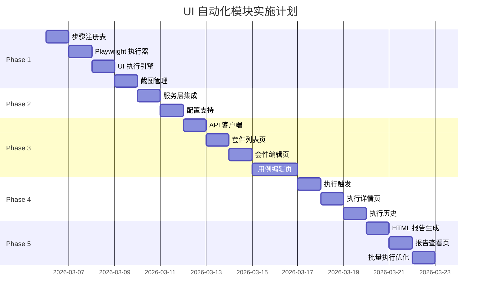

# UI 自动化测试模块实施计划

> **创建日期**: 2026-03-06
> **版本**: v1.0
> **状态**: 待确认

---

## 一、需求重述

基于现有后端基础，完成 UI 自动化测试模块的完整实现，包括：

### 核心目标
1. 实现 UI 测试执行引擎（Playwright for Web）
2. 创建前端管理界面
3. 支持用例执行和结果查看
4. 实现步骤级执行详情和截图

### 范围界定
- **本期实现**: Web 平台自动化（Playwright）
- **后续实现**: App 平台自动化（Airtest + Poco）
- **依赖**: 后端基础架构已完成（Models/Schemas/API）

---

## 二、实施阶段

### Phase 1: UI 执行引擎（后端核心）
**预计**: 2-3 小时 | **复杂度**: 高

#### Task 1.1: 步骤注册表
**文件**: `app/services/step_registry.py`

```python
# 实现内容
- StepRegistry 类（单例模式）
- 步骤注册装饰器
- 按平台获取执行函数
- 内置步骤注册（open_url, click, input, assert, screenshot）
```

**验收**:
- [ ] 可以注册和获取步骤处理函数
- [ ] 支持按平台区分实现

#### Task 1.2: Playwright 执行器
**文件**: `app/services/playwright_executor.py`

```python
# 实现内容
- PlaywrightExecutor 类
- 浏览器启动/关闭
- 页面导航
- 元素操作（click, fill, check）
- 断言方法
- 截图功能
- 录屏功能（可选）
```

**验收**:
- [ ] 可以打开浏览器并访问 URL
- [ ] 可以执行点击、输入操作
- [ ] 可以执行断言
- [ ] 失败时自动截图

#### Task 1.3: UI 执行引擎主入口
**文件**: `app/services/ui_executor.py`

```python
# 实现内容
- execute_ui_test 主函数（async）
- 步骤解析和调度
- 执行上下文管理
- 结果收集
- 异常处理
```

**验收**:
- [ ] 可以执行步骤列表
- [ ] 返回完整的执行结果
- [ ] 失败时停止执行

#### Task 1.4: 截图和视频管理
**文件**: `app/utils/ui_test_artifacts.py`

```python
# 实现内容
- 截图路径生成
- 视频录制管理
-  artifacts 清理
```

**验收**:
- [ ] 截图保存到正确路径
- [ ] 可以访问截图文件

---

### Phase 2: 服务层集成
**预计**: 1-2 小时 | **复杂度**: 中

#### Task 2.1: 更新 UiTestService
**文件**: `app/services/ui_test_service.py`

**修改内容**:
- `execute_case` 方法集成真实执行引擎
- 移除 Mock 实现
- 处理截图和视频路径存储

**验收**:
- [ ] 执行用例返回真实结果
- [ ] 截图路径正确保存

#### Task 2.2: 执行配置支持
**文件**: `app/schemas/ui_test.py`

**修改内容**:
- 添加执行配置 Schema
- 支持浏览器、头模式等选项

**验收**:
- [ ] 可以配置浏览器类型
- [ ] 可以配置是否头模式

---

### Phase 3: 前端基础界面
**预计**: 3-4 小时 | **复杂度**: 高

#### Task 3.1: API 客户端
**文件**: `frontend/src/api/ui-test.ts`

```typescript
// 实现内容
- 套件管理 API
- 用例管理 API
- 执行 API
- 类型定义
```

**验收**:
- [ ] TypeScript 类型完整
- [ ] API 调用成功

#### Task 3.2: 套件列表页
**文件**: `frontend/src/views/ui-test/index.vue`

```vue
<!-- 实现内容 -->
- 套件列表表格
- 平台筛选
- 创建套件按钮
- 执行套件操作
```

**验收**:
- [ ] 显示套件列表
- [ ] 可以创建套件
- [ ] 可以删除套件

#### Task 3.3: 套件编辑页
**文件**: `frontend/src/views/ui-test/SuiteEditor.vue`

```vue
<!-- 实现内容 -->
- 套件基本信息表单
- 平台选择（Web/App）
- 平台配置（JSON 编辑器）
- 用例列表（子路由）
```

**验收**:
- [ ] 可以编辑套件信息
- [ ] 配置可以保存

#### Task 3.4: 用例编辑页
**文件**: `frontend/src/views/ui-test/CaseEditor.vue`

```vue
<!-- 实现内容 -->
- 用例基本信息
- Gherkin 语法编辑器
- 步骤列表（可拖拽排序）
- 步骤添加对话框
- 步骤参数配置
```

**验收**:
- [ ] 可以添加/编辑/删除步骤
- [ ] 步骤可以拖拽排序
- [ ] 参数配置正确保存

---

### Phase 4: 执行和结果展示
**预计**: 2-3 小时 | **复杂度**: 中

#### Task 4.1: 执行触发
**文件**: `frontend/src/views/ui-test/CaseEditor.vue`

**修改内容**:
- 添加执行按钮
- 调用执行 API
- 轮询执行状态

**验收**:
- [ ] 点击执行触发测试
- [ ] 显示执行中状态

#### Task 4.2: 执行详情页
**文件**: `frontend/src/views/ui-test/ExecutionDetail.vue`

```vue
<!-- 实现内容 -->
- 执行摘要（状态、耗时）
- 步骤结果列表
- 步骤截图查看
- 错误信息展示
```

**验收**:
- [ ] 显示执行状态
- [ ] 显示步骤结果
- [ ] 可以查看截图
- [ ] 错误信息清晰展示

#### Task 4.3: 执行历史
**文件**: `frontend/src/views/ui-test/ExecutionHistory.vue`

```vue
<!-- 实现内容 -->
- 历史执行列表
- 执行趋势图表
- 通过率统计
```

**验收**:
- [ ] 显示历史执行记录
- [ ] 可以点击查看详情

---

### Phase 5: 报告和优化
**预计**: 2-3 小时 | **复杂度**: 中

#### Task 5.1: HTML 报告生成
**文件**: `app/services/ui_report_generator.py`

```python
# 实现内容
- 报告模板（Jinja2）
- 报告数据准备
- 报告文件生成
```

**验收**:
- [ ] 生成 HTML 报告
- [ ] 报告包含执行详情

#### Task 5.2: 报告查看页
**文件**: `frontend/src/views/ui-test/ReportView.vue`

**验收**:
- [ ] 可以查看 HTML 报告
- [ ] 报告样式美观

#### Task 5.3: 批量执行优化
**文件**: `app/services/ui_test_service.py`

**修改内容**:
- 并发执行支持
- 执行进度跟踪

**验收**:
- [ ] 批量执行多个用例
- [ ] 显示执行进度

---

## 三、依赖关系



---

## 四、技术栈

### 后端
| 组件 | 技术 | 版本 |
|------|------|------|
| 框架 | FastAPI | 0.109.0 |
| ORM | SQLAlchemy | 2.0.25 |
| 浏览器自动化 | Playwright | 1.40+ |
| 模板引擎 | Jinja2 | 3.1+ |

### 前端
| 组件 | 技术 | 版本 |
|------|------|------|
| 框架 | Vue 3 | 3.4+ |
| 语言 | TypeScript | 5.0+ |
| UI 库 | Element Plus | 2.4+ |
| HTTP | Axios | 1.6+ |

---

## 五、风险评估

| 风险 | 等级 | 缓解措施 |
|------|------|----------|
| Playwright 安装问题 | 中 | 提供安装脚本和镜像源 |
| 浏览器驱动兼容 | 低 | Playwright 自动管理驱动 |
| 前端状态管理复杂 | 中 | 使用 Pinia 集中管理 |
| 执行超时处理 | 中 | 添加超时和重试机制 |
| 截图文件管理 | 低 | 定期清理旧文件 |

---

## 六、验收标准

### Phase 1-2: 后端核心
- [ ] 可以执行 Web UI 测试用例
- [ ] 步骤级结果正确记录
- [ ] 失败时自动截图
- [ ] 执行结果返回完整

### Phase 3: 前端界面
- [ ] 套件可以 CRUD
- [ ] 用例可以 CRUD
- [ ] 步骤可以可视化编辑
- [ ] 界面交互流畅

### Phase 4: 执行展示
- [ ] 可以触发执行
- [ ] 实时显示执行状态
- [ ] 执行详情清晰展示
- [ ] 截图可以查看

### Phase 5: 报告优化
- [ ] HTML 报告生成
- [ ] 报告样式美观
- [ ] 批量执行支持
- [ ] 执行统计准确

---

## 七、文件清单

### 新增文件（后端）
```
app/services/
  ├── ui_executor.py           # UI 执行引擎（需实现）
  ├── playwright_executor.py   # Playwright 执行器（新增）
  ├── step_registry.py         # 步骤注册表（新增）
  └── ui_report_generator.py   # 报告生成器（新增）

app/utils/
  └── ui_test_artifacts.py     # 截图/视频管理（新增）
```

### 新增文件（前端）
```
frontend/src/
├── api/
│   └── ui-test.ts            # UI 测试 API（新增）
├── views/
│   └── ui-test/
│       ├── index.vue         # 套件列表（新增）
│       ├── SuiteEditor.vue   # 套件编辑（新增）
│       ├── CaseEditor.vue    # 用例编辑（新增）
│       ├── ExecutionDetail.vue # 执行详情（新增）
│       └── ExecutionHistory.vue # 执行历史（新增）
└── components/
    └── ui-test/
        ├── StepEditor.vue    # 步骤编辑器（新增）
        └── StepList.vue      # 步骤列表（新增）
```

### 修改文件
```
app/services/ui_test_service.py  # 集成执行引擎
app/schemas/ui_test.py           # 添加配置 Schema
```

---

## 八、时间估算

| 阶段 | 任务数 | 预计时间 |
|------|--------|----------|
| Phase 1: UI 执行引擎 | 4 | 2-3 小时 |
| Phase 2: 服务层集成 | 2 | 1-2 小时 |
| Phase 3: 前端界面 | 4 | 3-4 小时 |
| Phase 4: 执行展示 | 3 | 2-3 小时 |
| Phase 5: 报告优化 | 3 | 2-3 小时 |
| **总计** | **16** | **10-15 小时** |

---

## 九、下一步

**确认后执行顺序**:

1. **Phase 1** → 实现 UI 执行引擎（可独立测试）
2. **Phase 2** → 集成服务层（API 可执行）
3. **Phase 3** → 创建前端界面（可操作）
4. **Phase 4** → 执行和展示（完整流程）
5. **Phase 5** → 报告和优化（完善体验）

---

**等待确认**: 是否按此计划执行？(yes/修改)

确认后我将使用 `superpowers:executing-plans` 技能按任务逐一实施。
